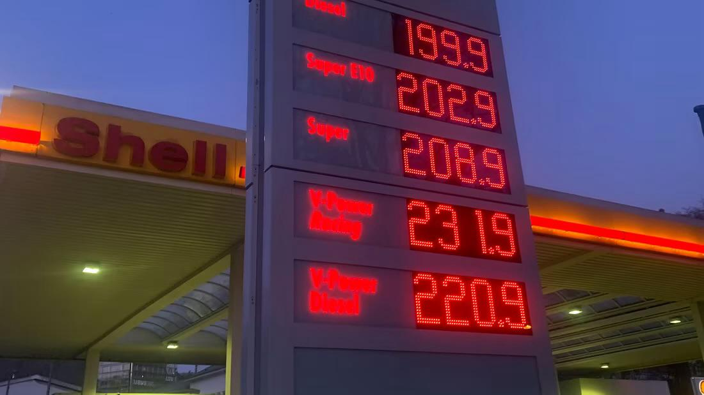
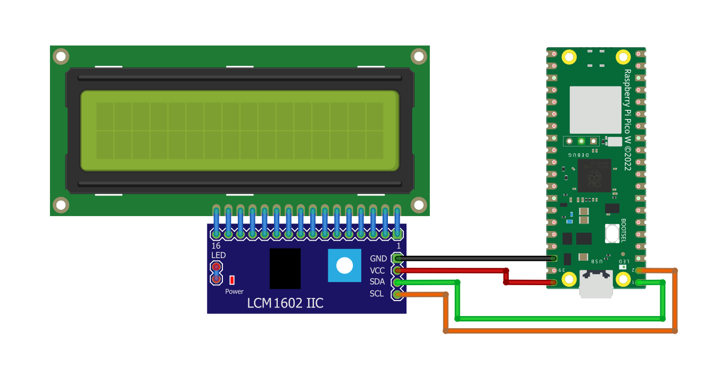
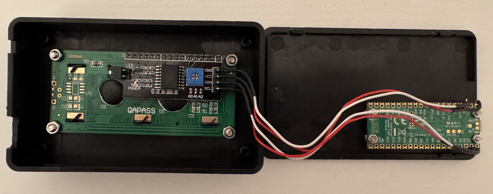
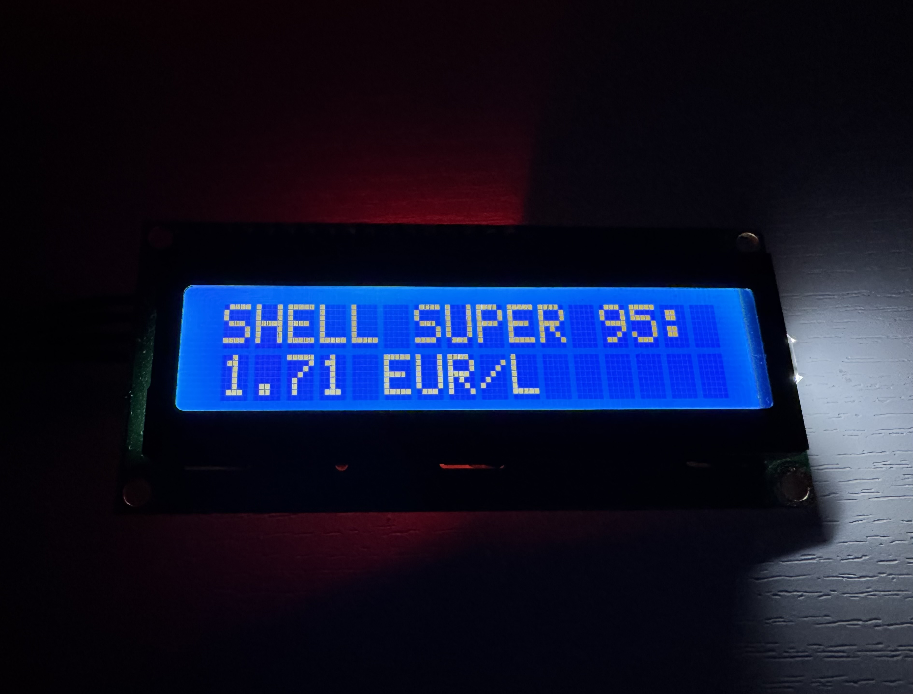
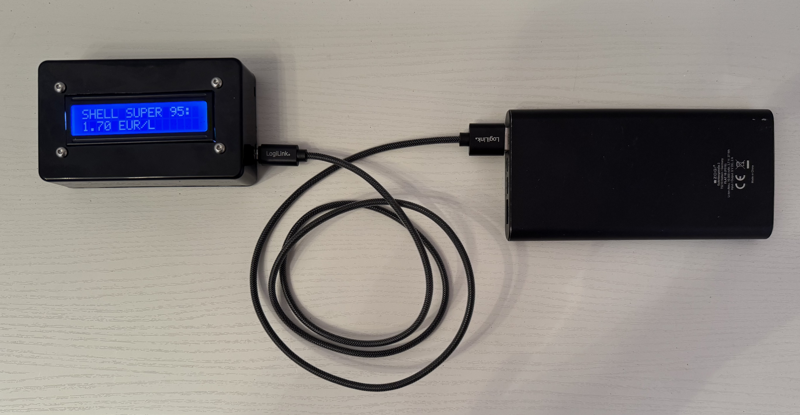

# IoT Fuel Price Display
<i>A simple IoT project for displaying live prices of a gas station in Germany.</i>

## 1 Introduction

Internet of things (IoT) describes devices with sensors, processing ability, software and other technologies that connect and exchange data with other devices and systems over the Internet or other communication networks [(source)](https://en.wikipedia.org/wiki/Internet_of_things). This field of computer technology is overly exciting and gains popularity across industry and private consumers. Smart devices are everywhere around us; we oftentimes don't even notice their presence. This is called silent computing. As a student of Information Systems, I was always curious about how to make your own smart device that does something useful. A few days ago, when driving past a gas station, a question came to my mind; Would it be possible to get the huge fuel price display into a small device that mirrors the live fuel price at home?<br>
<a name="gas_station" href="https://www.auto-motor-und-sport.de/verkehr/preisobergrenze-fuer-kraftstoffe-politiker-und-adac-fordern-spritpreisbremse/"><p align="center"></img></p></a>

Luckily, I also received a newsletter mail with the announcement that the [Raspberry Pi Pico 2W](https://www.raspberrypi.com/news/raspberry-pi-pico-2-w-on-sale-now/) was released at the end of November 2024. The cheap microcontroller is available for as little as 7.00 USD (7.50 EUR) (December 2024) and comes with WiFi and Bluetooth. Equipped with the idea and a brand-new IoT microcontroller, I created this project within two exciting days.

## 2 DIY IoT Display
### 2.1 Required Hardware and Materials
To build an analog fuel price display we need two main components: The Raspberry Pi Pico 2W and a [LCD](https://en.wikipedia.org/wiki/Liquid-crystal_display) display. Both are cheap and are available online for sale. For this project I use the [LCD1602 display with I2C interface](http://wiki.sunfounder.cc/index.php?title=I²C_LCD1602) pre-soldered. Here is a link to [AliExpress](https://www.aliexpress.com/item/1005007766980412.html), where you can buy this LCD display for about 1.00 EUR (December 2024).

Required components:
- A Raspberry Pi Pico 2W, barebone
- A LCD1602 display with PCF8574 module pre-soldered
- Four small copper wires or jumper wires (~10 cm)
- A few heat shrink tubes that fit the small wires
- A USB-A (male) to micro-USB (male) [OTG](https://en.wikipedia.org/wiki/USB_On-The-Go) data cable
- A powerbank (5V~1,2A with 10,000 mAh recommended)
- A wire with micro-USB (male) and an end that fits your powerbank
- A wireless home network (2.4GHz)
- A computer (preferably one that runs Windows 11)
- A soldering kit

<a name="optional_components"></a>Optional components:
- A 3D-printed or self-made plastic case
- Four M2 screws and twelve M2 nuts
- Four M3 screws and twelve M3 nuts

### 2.2 Hardware Setup

With all materials at hand, let's start to solder the display to the Raspberry Pi. If you have no soldering kit at home, consider buying [this one](https://aliexpress.com/item/1005006842091809.html). The LCD1602 display communicates via the [I2C protocol](https://en.wikipedia.org/wiki/I%C2%B2C), which means that we must solder the display pins to the Raspberry Pi like shown in this wiring diagram:<br>
<a name="scheamtic_wiring"><p align="center"></img></p></a>

I also recommend using heat shrinking tubes or some other kind of isolation because the pins are close to each other. This way you prevent any damage or unintended contact between the wires. The result could look something like this:<br>
<a name="internal_wiring"><p align="center"></img></p></a>

### 2.3 Flash Firmware

After you finished soldering, turn on your computer, grab the OTG cable, plug in one end of the cable into the Raspberry Pi, press and hold the white <kbd>BOOTSEL</kbd> button on the Raspberry Pi, and plug in the other end of the cable to your computer <b>while still holding the button</b>. Release the button only after your computer recognized the device. Now you should be able to find your Raspberry Pi on your computer where flash drives are typically listed. It should have the name ```RP2350```. Open the drive. Two files should appear:
- ```INDEX.HTM```
- ```INFO_UF2.TXT```

Don't delete, modify, or move those two files! Instead, download [this firmware file](https://downloads.raspberrypi.com/micropython/mp_firmware_unofficial_latest.uf2) and paste it to the drive. After a few seconds the drive should disappear from your computer. Now we have fully set up the hardware and are ready to continue with the software part of this project.

## 3 Software Setup
### 3.1 Tankerkoenig API
#### 3.1.1 API Key
The fuel prices in Germany are easy to retrieve. For any station in Germany, the current prices can be obtained from the [Tankerkoenig API](https://creativecommons.tankerkoenig.de). To use this API, you must request an API key, which is free if you are a private user and do not work for the petroleum industry. You must enter your email address and select the purpose of usage. I suggest you to choose "anderes Home-Automation-System", which is German for other home automation system. Leave the system text field blank, accept the terms and conditions, and you should receive your API key soon to the provided email address. Also, you must click the link in the email to activate your API key. You will need the API key soon.
#### 3.1.2 Finding a Gas Station ID
To display the live fuel price of a gas station of your choice you must find the corresponding gas station ID. This can be done by taking the following steps:
1. On [Google Maps](https://www.google.com/maps), drop a pin somewhere close to a gas station of your choice
2. Copy the displayed coordinates of the position (latitude and longitude), e.g., 50.113722, 8.656560
3. Paste the following API request URL into the search bar of any browser of your choice. Replace the values for lat (latitude) and lng (longitude) accordingly. Leave the search radius (rad) as it is (3km) or expand it if your station will not appear in the API response list. Also append your personal API key. Your request should look like this:<br>https://creativecommons.tankerkoenig.de/json/list.php?lat=50.113722&lng=8.656560&rad=3&sort=dist&type=all&apikey=XXXXXXXX-XXXX-XXXX-XXXX-XXXXXXXXXXXX
4. Hit enter and look at the results, they will be returned in the [JSON](https://en.wikipedia.org/wiki/JSON) format. You will find the desired gas station by its name and address. Copy and save its ID. It has the same format as your API key. As an example for this documentation, I will use a SHELL station in Frankfurt (Main) with the ID ```30d45fe3-08f4-40cd-82b0-b2c4f872b270```

### 3.2 Configure Parameters
By now you should have an API key and a station ID of your choice. Download [main.py](https://github.com/smolinde/iot-fuel-price-display/blob/master/main.py) and paste the API key and station ID into the code in lines 25 and 26. Make sure that you have a WiFi network with 2.4 GHz available, else the Raspberry Pi won't be able to connect to it if it is a 5.0 GHz network. Replace the values in lines 17 and 18 with your network name (SSID) and WiFi password (PSK). Set your desired fuel type. You can select from the following three fuel types:

- Diesel
- Super E5
- Super E10

By default, E5 is set in the code. The values for each fuel type are listed in line 30. You can set a banner with a maximum length of 16 characters in line 34. As an example, we will use the following one:

<b>SHELL SUPER 95:</b>

You can adjust the refreshing rate in line 37. By default, the fuel price will be refreshed every five minutes. The API documentation <b>asks users to avoid request frequencies below a five minute interval</b>. Therefore, consider increasing this value, but not lowering it.

### 3.3 LCD Display Library
To be able to communicate with the LCD1602 display, we need two additional files to download, [lcd_api.py](https://github.com/smolinde/iot-fuel-price-display/blob/master/lcd_api.py) and [pico_i2c_lcd.py](https://github.com/smolinde/iot-fuel-price-display/blob/master/pico_i2c_lcd.py). Don't modify those files! According to a [YouTube tutorial](https://youtu.be/bXLgxEcT1QU?si=cI-cmN6O4rcokXdl) by [NerdCave](https://www.youtube.com/@NerdCaveYT), I have copied those two files from this [GitHub repository](https://github.com/T-622/RPI-PICO-I2C-LCD) by [Tyler Peppy](https://github.com/T-622).
### 3.4 Upload Code Files to the Raspberry Pi
With all source files prepared, all that is left to do is to upload the three files to the Raspberry Pi. You can achieve this by following these steps:
1. Install Python on your computer if not already installed. Python can be downloaded from [here](https://www.python.org/downloads/)
2. Open [Microsoft PowerShell](https://learn.microsoft.com/en-us/powershell/) (or any other type of command line) and run the following command to install [MicroPython remote control](https://docs.micropython.org/en/latest/reference/mpremote.html):<br>

		pip install mpremote

3. Navigate with the [```cd```](https://en.wikipedia.org/wiki/Cd_(command)) command to the location where your three downloaded source codes files are.
4. Now you need to determine the ```COM``` port to which your Raspberry Pi has connected. To do so, run the following command:

		mpremote connect list

    Your output will look like this one:

		COM1 None 0000:0000 (Standard port types) None
		COM4 A2FD70930433DCB0 2e8a:0005 Microsoft None

     In my case, ```COM4``` is the port which I will use for communication, but it might differ from computer to computer.
5. With the ```COM``` port at hand, run the following three commands one after each other, also make sure to use your own ```COM``` port number:

		mpremote connect COM4 cp main.py :
		mpremote connect COM4 cp lcd_api.py :
		mpremote connect COM4 cp pico_i2c_lcd.py :

    These commands copy the files to the Raspberry Pi root directory. To verify that all three files were indeed copied, run the following command:

		mpremote connect COM4 ls

    Your output should look something like this:

		ls :
        		6996 lcd_api.py
        		3935 main.py
        		3299 pico_i2c_lcd.py

## 4 Run Project
At this point you are ready to run the code and observe the results on the LCD1602 display. To do so, simply unplug your Raspberry Pi and connect it to a powerbank via a suitable wire. The Raspberry Pi will immediately boot up and enter ```main.py```. It might take a few seconds until the WiFi connection is established. After that you should see something like this:<br>
<a name="working_fuel_price_display"><p align="center"></img></p></a>
If you run into a problem and something doesn't work immediately, please consider reading the next chapter before [creating a new issue](https://github.com/smolinde/iot-fuel-price-display/issues).
## 5 Troubleshooting
### 5.1 No WiFi Connection
If your Raspberry Pi is not able to connect to your WiFi even after several tries, please make sure that the following requirements are met:
- The WiFi network has a 2.4 GHz frequency
- The WiFi name (SSID) and password (PSK) are correct
- The Raspberry Pi is in the range of the WiFi network

In case you need to adjust some of the WiFi credentials in ```main.py```, please read [5.6](#56-update-software-files).
### 5.2 Parameter Error
If you receive a parameter error on your LCD1602 screen, this means that either your API key and/or station ID is wrong. Please double-check these values and update ```main.py``` with the instructions in [5.6](#56-update-software-files).
### 5.3 WLAN Connection Loss
If you encounter the message that the WiFi connection was lost it is most likely due to the following two reasons:
- The WiFi router was turned off
- Your device is too far from the WiFi router

Please make sure that your device stays in close range to your router. Alternatively, try to connect to your mobile phone hotspot, which should work anywhere.

### 5.4 Loss of Connection to Server
In case your device states that the connection to the server is lost, it is most likely due to the following two reasons:
- Your internet provider has an outage
- The [Tankerkoenig API](https://creativecommons.tankerkoenig.de) went down

Make sure you have internet access via the WiFi network and double-check online for outages of the API server.
### 5.5 Other Issues
In case you encounter some hardware-related issues or a problem that was not covered by this section, feel free to [open a new issue here](https://github.com/smolinde/iot-fuel-price-display/issues). If you are not able to connect via ```mpconnect``` because you messed up the code, please follow the instructions in [5.7](#57-emergency-reset-and-memory-wipe).
### 5.6 Update Software Files
In case you want to overwrite ```main.py``` on the Raspberry pi, follow these steps:
1. Connect your Raspberry Pi to your computer with the OTG data cable
2. To stop the already running program, you need to connect to the internal MicroPython shell of the Raspberry Pi. To do so, run the following command:

		mpremote connect COM4

3. Now to really stop the program, press and hold down <kbd>CTRL</kbd> + <kbd>C</kbd> for a few seconds until you see following arrows appearing in your console:

    ```>>>```

4. Now exit the shell with <kbd>CTRL</kbd> + <kbd>X</kbd>
5. Navigate with the ```cd``` command to the directory where the updated source file ```main.py``` is
6. To update and overwrite the file, run the following command:

		mpremote connect COM4 cp main.py :

7. You can now test the new configuration by running the following command:

		mpremote connect COM4 run main.py

8. Now you are running in debugging mode, so every exception and output will be displayed in your shell.
### 5.7 Emergency Reset and Memory Wipe
Don't panic if you cannot access your Raspberry Pi any longer via ```mpconnect```, we all have been there accidentally running an endless loop or an unlimited recursion. If you need to wipe the flash memory and reset the Raspberry Pi, follow these steps:
1. Download the [flash nuke file](https://datasheets.raspberrypi.com/soft/flash_nuke.uf2)
2. Press down and hold the <kbd>BOOTSEL</kbd> button on your Raspberry Pi while still holding the button, connect it to your computer
3. Similar to [flashing the firmware](#23-flash-firmware), paste the downloaded flash nuke into the ```RP2350``` drive
4. The ```RP2350``` drive will disappear and reappear again
5. Continue restoring the system from [2.3](#23-flash-firmware)
## 6 Further Project Ideas
Now it's your turn to become creative! You can start by constructing or 3D-printing a case for the Raspberry Pi Pico 2W and the LCD1602 display. As listed in [optional components](#optional_components), you need M2 and M3 screws as well as corresponding nuts to fix everything well to the case. I made a case from a [small DIY junction box](https://www.amazon.de/dp/B08P3DDC9Z) and the result looks like this:<br>
<a name="final_result"><p align="center"></img></p></a>

Also, here is a list of more complex project ideas:
- Enhance this project with more functionality and configuration options
- Development of a Mobile app to configure the device
- Set up a separate server that will receive data from IoT device and run machine learning to predict low fuel prices
- Model and build a fancy IoT display with two or more LCD displays to display multiple fuel prices
- Integration into a vehicle
- Optimize hardware with a rechargeable battery and mobile internet

Finally, there are no limits set to your own creativity! You might produce an amazing project and even create a business based on your prototype. I really hope that this project will inspire tech enthusiasts and spark love for IoT development.
## 7 Feedback and Contribution
I am always glad to receive any type of constructive criticism. Therefore, feel free to open an issue [here](https://github.com/smolinde/iot-fuel-price-display/issues) with your thoughts, comments, or questions. If you want to extend this IoT project or implement one of the ideas from the [previous chapter](#6-further-project-ideas), feel free to [fork this repository](https://github.com/smolinde/iot-fuel-price-display/fork) and modify the code as your wish!<br><br>
<p align="center"><a href="https://www.linkedin.com/in/smolinde/"></img></a> <a href="https://www.instagram.com/smolinde/"></img></a> <a href="https://www.duscloud.eu/sites/about/sub"></img></a></p>